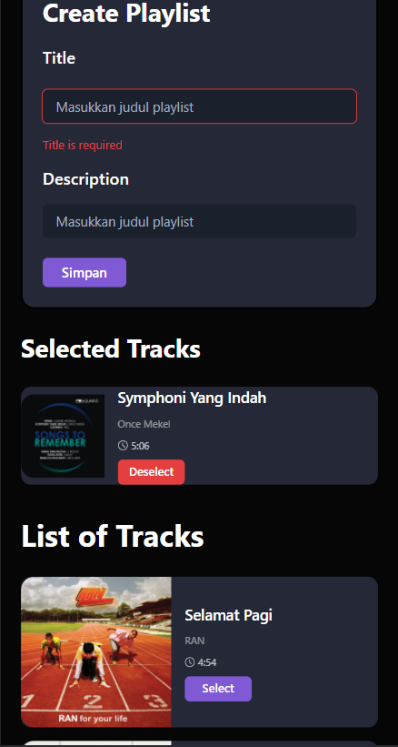

# Mozaik Playlist Spotify

Mozaik Playlist Spotify is an application to create our own spotify playlist that personalized from our mood, unique taste and also memories. We can select our best tracks and named it by ourself. This application is my final project submission for #GenerasiGIGIH


## Features

### Requirement Features from Gigih

- [x] User need to login first before accessing the Create Playlist page
- [x] Select Songs
- [x] A form for playlist title and description
- [x] Token stored on Redux
- [x] toBeInTheDocument() and userEvent for Testing
- [x] Zero eslint error

### Additional Features

- Impelement ChakraUI Component
- Written in Typescript
- Get UserPofile store on Redux
- Testing for searchAPI
- Impelement LocalStorage to save token
- Show User's profile (image and name)
- Show list of user's playlist with image,name and description
- Show list of user's song from spesific playlist with table
- Show list of user's top tracks
- Responsive design

## Installion

- Clone the repository

```
git clone https://github.com/moehzi/spotify-playlist.git
```

- Go to the project directory

```
cd spotify-playlist
```

- Change the Spotify Key on .env file to your own Spotify Key
- Change the Redirect URI on .env file to http://localhost:3000
- Install dependencies

```
npm install
```

- Run the app

```
npm start
```

## Preview

Here some screenshots how's the app run

1. You need to login first in Landing Page with spotify account and then you will be redirect to page `/create-playlist` .
<table>
  <tr>
    <td valign="top">
        </img>
    </td>
    <td valign="top">
       </img>
    </td>
  </tr>
</table>

2. In `create-playlist` page, you will see Navbar, Search Bar, Profile and also List Of Track with Button Select there.

<table>
  <tr>
    <td valign="top">
        </img>
    </td>
    <td valign="top">
       </img>
    </td>
  </tr>
</table>

3. If you want to search your song to make your playlist you can just typing it in the search box and the app will show the result. After you click the `Select Button` you will see the form playlist with Title and Description and the song that you were selected will be on Selected Track List.

<table>
  <tr>
    <td valign="top">
        </img>
    </td>
    <td valign="top">
       </img>
    </td>
  </tr>
</table>

4. You can just submit if you already fill the input form and you will get notify if you're playlist has been created and you will be redirect to `your-playlist` page which show list of your playlist in Spotify

<table>
  <tr>
    <td valign="top">
        </img>
    </td>
    <td valign="top">
       </img>
    </td>
  </tr>
</table>

5. You can also see the list of your song with just clicked the card of the playlist and you will be redirect to page `detail-playlist`.

<table>
  <tr>
    <td valign="top">
        </img>
    </td>
    <td valign="top">
       </img>
    </td>
  </tr>
</table>

6. Lastly, if you want to get out from the app you can click the profile button at the top corner and click the logout button and you will be redirect to `/` home page.

<table>
  <tr>
    <td valign="top">
        </img>
    </td>
    <td valign="top">
       </img>
    </td>
  </tr>
</table>
